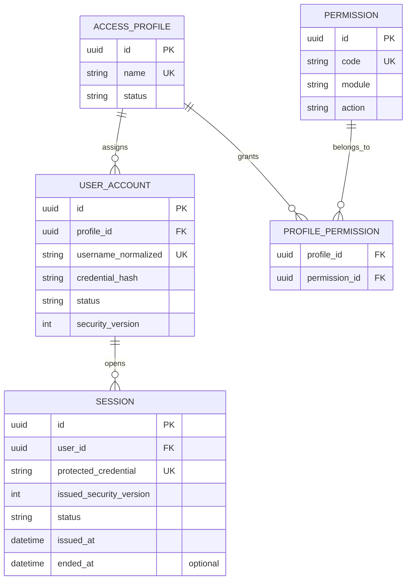
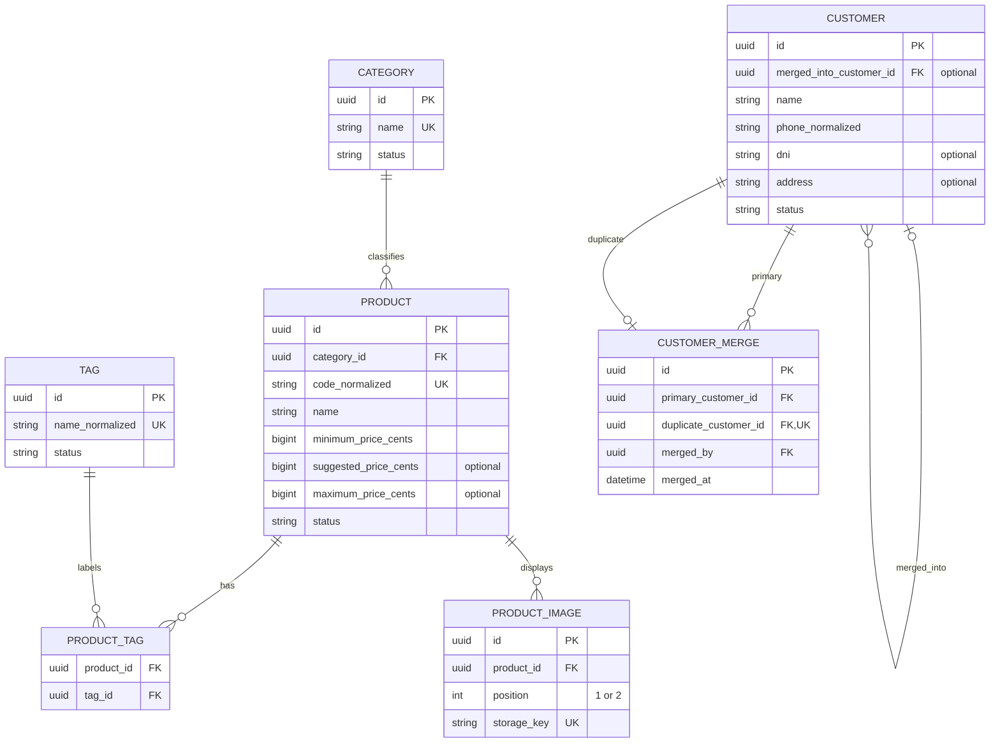
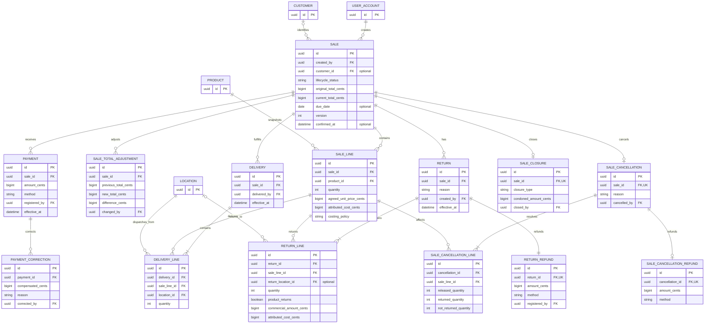
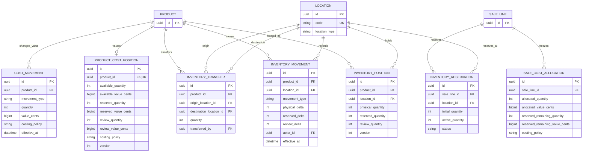
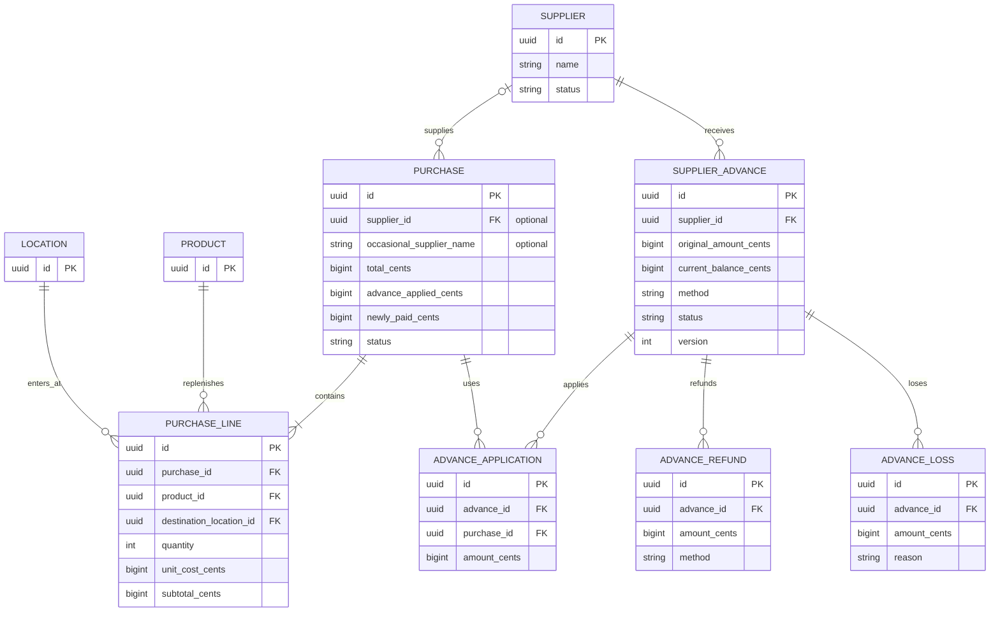
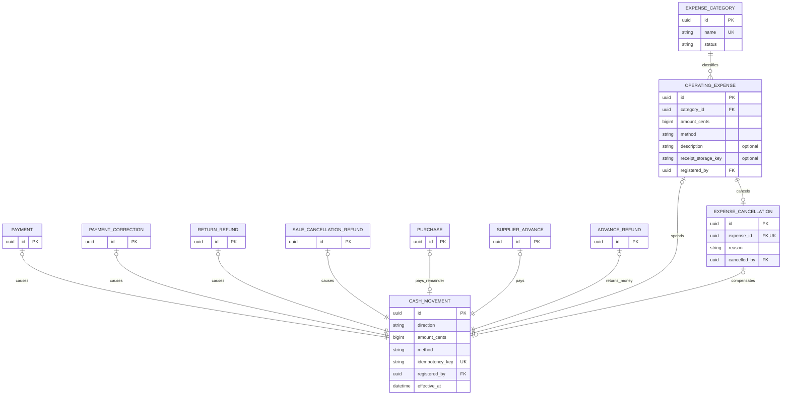
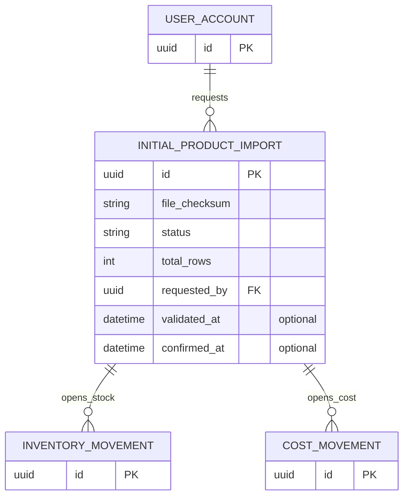

# Diagrama entidad-relación lógico

**Estado:** Versión inicial confirmada el 2026-08-24.

Este ERD visualiza el [modelo relacional confirmado](relational-model.md). Está
segmentado para conservar legibilidad y no representa todavía modelos Prisma,
nombres físicos definitivos ni todas las restricciones `CHECK`.

## Notación

| Símbolo | Significado |
| --- | --- |
| `||` | exactamente uno |
| `o|` | cero o uno |
| `|{` | uno o muchos |
| `o{` | cero o muchos |
| `PK` | clave primaria |
| `FK` | clave foránea |
| `UK` | clave única o integrante de ella |

Los atributos mostrados son los necesarios para comprender identidad, relación y
opcionalidad. Importes, estados, snapshots y metadatos completos permanecen en el
modelo relacional y las restricciones.

## Identidad y acceso

Inicialmente existen los perfiles Administrador y Empleado. La relación N:M deja
abierta la creación futura de perfiles personalizados sin cambiar el modelo.

## Catálogo y clientes

Todo producto tiene categoría. El máximo de dos imágenes se protege mediante una
posición única que solo admite 1 o 2. DNI y dirección del cliente son opcionales;
nombre y teléfono son obligatorios. La autorrelación de cliente permite resolver
el principal sin reescribir ventas históricas.

## Ventas, pagos y cumplimiento

Una venta confirmada exige una o más líneas, pero un borrador puede estar vacío;
esa diferencia de estado requiere validación transaccional y no se expresa por
completo mediante la cardinalidad gráfica. Pago, entrega y cierre siguen siendo
dimensiones independientes.

## Inventario y costo

`INVENTORY_POSITION` es única por producto y ubicación. La posición de costo es
única y global por producto: un traslado cambia la posición física, no el costo.
Los libros de movimientos son históricos; las posiciones son proyecciones
transaccionales reconciliables.

## Compras y adelantos

Una compra identifica un proveedor registrado o conserva la instantánea de uno
ocasional, nunca ambos. Los adelantos solo pertenecen a proveedores registrados.
`ADVANCE_APPLICATION` resuelve la relación N:M entre adelantos y compras.

## Finanzas y gastos

Cada movimiento de caja tiene exactamente un origen, aunque el diagrama muestre
todas las relaciones causales posibles. Aplicar un adelanto o reconocer una
pérdida no genera otro movimiento de caja porque el dinero salió al crear el
adelanto. Una compra totalmente cubierta por adelantos tampoco genera un nuevo
egreso.

## Importación inicial

Solo existe una importación inicial confirmada. Sus referencias causales en los
movimientos permiten explicar el stock y costo de apertura sin inventar compras ni
egresos. Los productos creados se identifican mediante esos movimientos y el mismo
commit atómico, sin añadir una propiedad permanente de importación al catálogo.

## Referencias de auditoría

Para no saturar todos los diagramas, varias relaciones hacia `USER_ACCOUNT` se
muestran únicamente como atributos FK. Incluyen creador, registrador, aprobador,
confirmador, quien ajusta, traslada, fusiona, cancela o ejecuta una devolución.
Todas usan `ON DELETE RESTRICT` cuando existe historia.

## Relaciones causales explícitas

Los libros de caja, inventario y costo no utilizarán una referencia polimórfica
sin FK. El mapeo físico contendrá referencias opcionales a documentos causales y
una restricción “exactamente una”. En el ERD se omiten algunas líneas causales de
inventario y costo para mantenerlo legible; esto no elimina la relación definida
en el modelo relacional.

## Invariantes no expresables por el gráfico

El ERD no sustituye las [restricciones](integrity-constraints.md) ni los
[límites transaccionales](transactions-and-concurrency.md). Entre otras reglas, el
gráfico no puede garantizar por sí solo:

- cliente obligatorio si una venta confirmada queda con saldo;
- uno o más detalles únicamente a partir de la confirmación;
- acumulados de pagos, reservas, entregas y devoluciones;
- mismo proveedor entre compra y adelantos aplicados;
- correspondencia entre movimiento, dirección y causa;
- reconciliación de posiciones contra libros históricos;
- orden y atomicidad de bloqueos concurrentes.

## Pendiente para el mapeo físico

- nombres definitivos de modelos, relaciones y columnas Prisma;
- representación de enums;
- constraints e índices que requieran migración SQL personalizada;
- nombres de todas las claves foráneas causales;
- tipos PostgreSQL concretos y valores predeterminados.

Confirmar el ERD valida relaciones y cardinalidades lógicas, no decide
automáticamente esos detalles de implementación.
