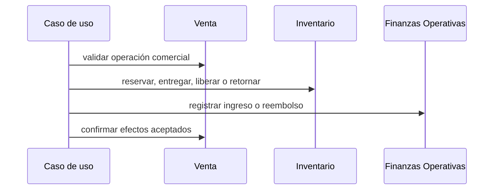

# Agregados e invariantes

**Estado:** versión inicial confirmada el 2026-08-16.

Los agregados definen fronteras de consistencia del modelo, no tablas ni módulos desplegables. Esta versión profundiza primero en Operaciones Comerciales, el dominio central de Nova.

## Agregado Venta

### Frontera

`Venta` es la raíz del agregado e incluye inicialmente:

- sus `Línea de venta`;
- sus `Pago` y correcciones;
- sus `Ajuste de total acordado`;
- sus `Entrega` y cantidades entregadas;
- sus `Devolución` y líneas devueltas;
- su cierre incompleto o cancelación.

Referencia por identidad, sin incorporar las entidades externas:

- `ClienteId`;
- `ProductoId`;
- `UbicacionId`;
- `UsuarioId`.

La frontera es deliberadamente más rica que un CRUD porque los pagos, devoluciones, ajustes y entregas cambian cálculos que deben permanecer coherentes entre sí. En el tamaño esperado de Nova, una venta contiene pocas líneas y pocos movimientos.

### Comportamientos de la raíz

El lenguaje esperado del modelo se aproxima a:

- `crearBorrador()`;
- `agregarLinea()` y `modificarLinea()`;
- `confirmar()`;
- `registrarPago()`;
- `corregirPago()`;
- `ajustarTotalAcordado()`;
- `registrarEntrega()`;
- `aprobarDevolucion()`;
- `cerrarIncompleta()`;
- `cancelar()`;
- `calcularSaldo()`;
- `determinarSituacionDePago()` y `determinarSituacionDeEntrega()`.

Los nombres finales se mantendrán alineados con el lenguaje ubicuo al implementar el dominio.

## Invariantes de composición

1. Una venta confirmada contiene al menos una línea.
2. Cada línea posee producto, cantidad entera positiva, precio unitario acordado e instantánea comercial.
3. El importe original de una línea es cantidad por precio unitario acordado.
4. El total original de la venta es la suma de los importes originales de sus líneas.
5. Las referencias históricas de producto y precio de una línea confirmada no cambian cuando cambia el Catálogo.
6. Una venta en borrador puede cambiar líneas y condiciones sin producir pagos ni efectos de inventario o caja.
7. Las líneas de una venta confirmada no se modifican ni eliminan directamente.

Que un mismo producto aparezca en más de una línea no se prohíbe: puede ser necesario distinguir ubicaciones o condiciones de cumplimiento.

## Invariantes monetarias

1. Todo pago pertenece a una sola venta y tiene monto positivo, método, fecha y registrador.
2. Un pago nuevo no supera el saldo vigente.
3. Un pago confirmado no se borra ni se sobrescribe; su corrección conserva el original, la razón, el responsable y el movimiento compensatorio.
4. El total acordado solo cambia mediante un ajuste administrativo con razón, responsable, fecha, valor anterior y valor nuevo.
5. Un ajuste no puede crear una situación incompatible con pagos y reembolsos vigentes.
6. El monto condonado nunca es negativo ni supera el saldo existente al cerrar incompleta la venta.
7. Cerrar incompleta una venta condona exactamente el saldo que el negocio decide dejar de cobrar y conserva la razón.
8. Una venta con saldo pendiente requiere un `ClienteId`.
9. Una fecha de vencimiento vencida solo produce la situación derivada `atrasada`; no genera cargos, pagos ni cancelaciones.

### Cálculos conceptuales

```text
total comercial neto = total acordado vigente - importe comercial devuelto
pago neto vigente    = pagos vigentes - reembolsos realizados
saldo pendiente      = max(0, total comercial neto - pago neto vigente - monto condonado)
```

Estos valores se derivan de operaciones trazables. Si posteriormente se almacenan totales precalculados por rendimiento, serán proyecciones verificables y no hechos editables manualmente.

## Invariantes de entrega y separación

1. Para cada línea, la cantidad entregada, reservada, pendiente y devuelta nunca es negativa.
2. Una distribución inicial no puede entregar o reservar más unidades que la cantidad vendida.
3. La cantidad comercialmente devuelta no supera la cantidad previamente entregada y aún no devuelta.
4. Una entrega no puede superar la cantidad pendiente de entrega de la línea.
5. Una venta puede combinar líneas entregadas, reservadas y pendientes.
6. La situación de entrega se calcula independientemente de la situación de pago.
7. Confirmar una intención de entrega o separación no demuestra por sí solo que el stock cambió: Inventario debe aceptar el movimiento correspondiente.
8. Cancelar libera únicamente las cantidades reservadas que todavía permanecen en el negocio; no inventa retornos de productos ya entregados.

## Invariantes de devolución

1. Toda devolución tiene razón, aprobador y al menos una línea con cantidad positiva.
2. Solo se devuelven cantidades de líneas pertenecientes a la misma venta.
3. La suma devuelta por línea no supera la cantidad previamente entregada y todavía no devuelta.
4. Toda devolución produce un reembolso trazable.
5. El reembolso no supera el importe neto efectivamente pagado, atribuible y todavía no reembolsado por las unidades seleccionadas.
6. El método del reembolso representa la salida real y puede diferir del método de los pagos originales.
7. El retorno físico es opcional e independiente del reembolso.
8. Si existe retorno, se especifican ubicación y condición; Inventario decide su efecto sobre existencia y disponibilidad.

La regla exacta para atribuir pagos a unidades en devoluciones parciales se concretará en el diseño de cálculos monetarios antes del modelo de datos.

## Invariantes de ciclo de vida

1. Una venta nace en borrador.
2. Solo el borrador admite edición directa de líneas y condiciones.
3. Confirmar una venta fija su composición histórica y habilita sus efectos comerciales.
4. Una venta pagada puede seguir parcialmente entregada; una venta entregada puede conservar saldo.
5. Una venta cancelada no vuelve a borrador ni a confirmada.
6. La cancelación conserva todos los pagos, entregas, reembolsos, liberaciones y retornos ocurridos.
7. Las compensaciones necesarias para cancelar se registran como operaciones nuevas, nunca borrando la historia.
8. Una operación terminal puede admitir correcciones administrativas posteriores únicamente para reconciliar efectos reales, no para reabrir la venta silenciosamente.

Los estados y sus transiciones exactas se documentan en [Estados y transiciones](states-and-transitions.md).

## Autorización y dominio

El agregado protege reglas de negocio; la capa de aplicación verifica quién puede invocar cada caso de uso.

- El empleado opera sus propias ventas y pagos permitidos.
- El administrador puede operar ventas ajenas y autorizar precios bajo el mínimo, ajustes, cierres incompletos, cancelaciones y devoluciones.
- Cuando una regla dependa de una aprobación administrativa, el agregado recibe una autorización ya verificada y conserva la identidad del aprobador cuando la trazabilidad lo exige.

El dominio no depende de roles de NestJS, guards HTTP ni estructuras de sesión.

## Coordinación con otros agregados y contextos

`Venta` no modifica directamente Inventario ni Finanzas Operativas. Un caso de uso de aplicación coordina:



Para operaciones que no pueden quedar aplicadas parcialmente, la infraestructura ejecutará la coordinación en una transacción técnica única sobre PostgreSQL. Esto no fusiona los modelos ni permite que un agregado modifique internamente a otro.

## Agregados de otros contextos

Sus fronteras confirmadas se detallan en [Modelos tácticos por contexto](context-models/README.md):

| Contexto | Agregado candidato | Frontera preliminar |
| --- | --- | --- |
| Catálogo | `Producto` | Datos comerciales, precios de referencia, categoría, etiquetas e imágenes |
| Clientes | `Cliente` | Identidad y datos personales normalizados |
| Inventario | `Existencia de producto por ubicación` | Cantidades físicas, reservadas y versión de concurrencia |
| Abastecimiento | `Compra` | Líneas, costos e ingreso confirmado |
| Abastecimiento | `Anticipo a proveedor` | Monto original, aplicaciones, reembolsos y saldo |
| Finanzas Operativas | `Movimiento de caja` | Entrada o salida inmutable con causa y método |
| Identidad y Acceso | `Cuenta de usuario` | Credencial, estado, rol y revocación de acceso |

La tabla es un resumen; los documentos de cada contexto son la fuente de verdad de sus invariantes y eventos.

## Riesgo y regla de evolución

Mantener pagos, entregas y devoluciones dentro de `Venta` simplifica las invariantes del MVP, pero puede hacer crecer el agregado. Se separará alguno de estos conceptos si aparecen:

- ventas con cientos de movimientos;
- cargas o bloqueos perceptibles al registrar pagos;
- conflictos de concurrencia frecuentes;
- necesidad de gestionar pagos o entregas independientemente de una venta.

La extracción exigirá conservar las mismas invariantes mediante versiones, contratos y coordinación explícita.
