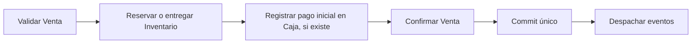
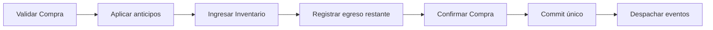
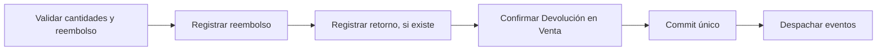

# Modelo conceptual de Nova

**Estado:** versión inicial confirmada el 2026-08-16.

Este diagrama resume las fronteras tácticas confirmadas. Las flechas representan referencias por identidad, consultas o coordinación de casos de uso; no son claves foráneas, llamadas HTTP ni dependencias directas entre entidades.

```mermaid
flowchart TB
    subgraph IAM[Identidad y Acceso]
        Cuenta[Cuenta de usuario]
        Perfil[Perfil de acceso]
        Sesion[Sesión]
        Cuenta -->|perfilId| Perfil
        Sesion -->|usuarioId| Cuenta
    end

    subgraph CAT[Catálogo]
        Producto[Producto]
        Categoria[Categoría]
        Etiqueta[Etiqueta]
        Producto -->|categoriaId| Categoria
        Producto -->|etiquetaIds| Etiqueta
    end

    subgraph CLI[Clientes]
        Cliente[Cliente]
    end

    subgraph COM[Operaciones Comerciales - dominio central]
        Venta[Venta]
        LineaVenta[Línea de venta]
        Pago[Pago]
        Entrega[Entrega]
        Devolucion[Devolución]
        Ajuste[Ajuste de total]
        Venta --> LineaVenta
        Venta --> Pago
        Venta --> Entrega
        Venta --> Devolucion
        Venta --> Ajuste
    end

    subgraph INV[Inventario]
        Existencia[Existencia por producto y ubicación]
        Reserva[Reserva activa]
        MovimientoInv[Movimiento de inventario]
        Traslado[Traslado]
        Existencia --> Reserva
        MovimientoInv -.->|historial inmutable| Existencia
        Traslado -.->|coordina origen y destino| Existencia
    end

    subgraph ABA[Abastecimiento]
        Proveedor[Proveedor]
        Compra[Compra]
        Anticipo[Anticipo a proveedor]
        Compra -->|proveedorId| Proveedor
        Anticipo -->|proveedorId| Proveedor
        Compra -.->|aplicaciones| Anticipo
    end

    subgraph FIN[Finanzas Operativas]
        MovimientoCaja[Movimiento de caja]
        Gasto[Gasto operativo]
        CategoriaGasto[Categoría de gasto]
        Gasto --> CategoriaGasto
        Gasto -->|egreso causal| MovimientoCaja
    end

    subgraph ANA[Analítica]
        Lecturas[Modelos de lectura reconstruibles]
    end

    Venta -->|clienteId| Cliente
    LineaVenta -->|productoId + instantánea| Producto
    Venta -->|actorIds| Cuenta
    Venta -.->|reserva, entrega y retorno| Existencia
    Venta -.->|cobros y reembolsos| MovimientoCaja
    Compra -->|productoIds| Producto
    Compra -.->|ingresos físicos| Existencia
    Compra -.->|egreso restante| MovimientoCaja
    Anticipo -.->|egreso, reembolso| MovimientoCaja

    Venta --> Lecturas
    Existencia --> Lecturas
    Producto --> Lecturas
    Cliente --> Lecturas
    Compra --> Lecturas
    Anticipo --> Lecturas
    MovimientoCaja --> Lecturas
    Cuenta --> Lecturas
```

## Fronteras esenciales

- `Venta` protege líneas, pagos, entregas, devoluciones, ajustes y saldo.
- `Existencia` protege cantidades de un producto en una ubicación y sus reservas activas.
- `Producto` no contiene stock ni costos de compra.
- `Cliente` no contiene ventas o deuda.
- `Compra` y `Anticipo` explican adquisición y aplicación de dinero, pero no son movimientos de caja.
- `Movimiento de caja` registra la entrada o salida real con una causa externa.
- `Cuenta de usuario` proporciona actor y capacidades, pero no incorpora reglas de los otros contextos.
- Analítica solo lee y combina fuentes confirmadas.

## Coordinaciones atómicas principales

### Confirmar venta

### Confirmar compra

### Aprobar devolución

La capa de aplicación coordina estas operaciones. Ningún agregado importa o modifica internamente otro agregado.

## Modelo y persistencia

El diagrama no exige una tabla por clase ni que todas las relaciones usen claves foráneas idénticas a las referencias conceptuales. La Fase 4 traducirá las fronteras a un modelo relacional preservando invariantes, historial y concurrencia.
