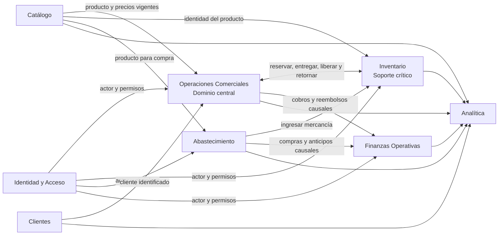

# Mapa de contextos

**Estado:** versión inicial confirmada el 2026-08-16.

Las flechas indican qué contexto proporciona información o capacidades a otro. Describen autoridad del modelo, no llamadas HTTP ni despliegues separados.

## Relaciones confirmadas

| Upstream | Downstream | Patrón | Contrato conceptual |
| --- | --- | --- | --- |
| Catálogo | Operaciones Comerciales | Customer–Supplier | Identidad, estado y precios vigentes del producto |
| Catálogo | Inventario | Customer–Supplier | Identidad del producto |
| Catálogo | Abastecimiento | Customer–Supplier | Producto adquirible |
| Clientes | Operaciones Comerciales | Customer–Supplier | Cliente identificado |
| Operaciones Comerciales e Inventario | Mutua | Partnership | Reserva, entrega, liberación y retorno coherentes |
| Abastecimiento | Inventario | Customer–Supplier | Ingreso físico causado por una compra |
| Operaciones Comerciales | Finanzas Operativas | Customer–Supplier | Ingreso o egreso de caja con causa comercial |
| Abastecimiento | Finanzas Operativas | Customer–Supplier | Egreso o devolución con causa de abastecimiento |
| Contextos operativos | Analítica | Customer–Supplier | Datos de lectura y hechos confirmados |
| Identidad y Acceso | Contextos protegidos | Open Host Service interno | Actor autenticado y capacidades asignadas |

## Estrategia de integración inicial

- Todo vive en una sola API NestJS y una sola base PostgreSQL.
- Los contextos no comparten entidades de dominio.
- Se comunican mediante contratos de aplicación, identidades y datos explícitos.
- Las operaciones que no pueden quedar parcialmente aplicadas utilizarán una transacción técnica coordinada fuera del dominio.
- Los eventos expresan hechos confirmados y alimentan reacciones posteriores; no sustituyen la coordinación atómica ni implican consistencia eventual por defecto.
- Analítica puede utilizar consultas optimizadas de solo lectura sin atravesar repositorios de agregados.
- Cloudinary y otros proveedores externos se protegerán mediante adaptadores; su modelo no entrará al dominio.

## Propiedad

Durante el MVP, un mismo equipo pequeño es responsable de todos los contextos. Las fronteras existen para proteger el lenguaje y las dependencias, no para simular una organización con múltiples equipos.
