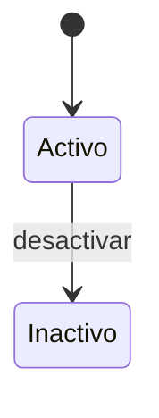

# Modelo táctico de Catálogo

**Estado:** versión inicial confirmada el 2026-08-16.

Catálogo es autoridad sobre la identidad comercial vigente de un producto y sus referencias de precio. No posee unidades físicas, costos de adquisición, precios históricos de ventas ni reglas de cobro.

## Agregado Producto

### Frontera

`Producto` es la raíz e incluye:

- código manual;
- nombre y descripción opcional;
- `CategoriaId` obligatoria;
- conjunto de `EtiquetaId` opcionales;
- rango de precios de referencia;
- hasta dos referencias de imagen;
- estado activo o inactivo.

Categoría y Etiqueta son agregados independientes y se referencian por identidad. Las imágenes se expresan mediante una referencia del dominio; la URL, identificador o respuesta de Cloudinary pertenece al adaptador.

### Objetos de valor

- `CodigoProducto`: texto normalizado, no vacío y único en el catálogo.
- `NombreProducto`: texto no vacío con límites de longitud por definir en datos.
- `RangoPrecios`: mínimo obligatorio, sugerido y máximo opcionales.
- `ReferenciaImagen`: identidad opaca y metadatos estrictamente necesarios, sin depender de Cloudinary.
- `ProductoId`, `CategoriaId` y `EtiquetaId`: identidades tipadas e inmutables.

### Comportamientos

- `crear()`;
- `actualizarDatos()`;
- `cambiarCodigo()`;
- `cambiarCategoria()`;
- `asignarEtiqueta()` y `retirarEtiqueta()`;
- `actualizarPrecios()`;
- `asociarImagen()` y `retirarImagen()`;
- `desactivar()`.

No existe `eliminar()` para un producto con historia. La desactivación preserva sus referencias en ventas, compras y movimientos.

## Invariantes de Producto

1. Código, nombre, categoría y precio mínimo son obligatorios.
2. El código normalizado es único incluso frente a diferencias irrelevantes de espacios o mayúsculas definidas por la normalización.
3. Cada variante comercial usa un producto y código diferentes.
4. Si existe sugerido, mínimo es menor o igual que sugerido.
5. Si existe máximo, mínimo es menor o igual que máximo.
6. Si existen sugerido y máximo, sugerido es menor o igual que máximo.
7. Un producto tiene como máximo dos imágenes.
8. Las etiquetas repetidas no se asignan dos veces.
9. Una categoría o etiqueta inactiva permanece visible históricamente, pero no puede asignarse a operaciones nuevas.
10. Un producto inactivo no participa en ventas, compras o ingresos nuevos, aunque continúa disponible para consultas históricas.
11. Cambiar precios vigentes no modifica instantáneas ni precios acordados de ventas confirmadas.
12. Un costo nuevo de compra puede sugerir revisar precios, pero nunca los cambia automáticamente.

La unicidad del código y la vigencia de categoría o etiquetas requieren consulta mediante puertos del caso de uso. El agregado protege su validez interna, mientras la base de datos añadirá restricciones como última defensa.

## Agregado Categoría

`Categoría` conserva identidad, nombre normalizado y estado.

Invariantes:

- el nombre es obligatorio;
- no existe otra categoría activa equivalente;
- una categoría usada se renombra o desactiva, no se elimina;
- desactivarla impide asignaciones nuevas sin romper productos existentes.

Estados: `activa` e `inactiva`. No se reactiva automáticamente; una reactivación futura deberá ser una operación administrativa explícita si se incorpora.

## Agregado Etiqueta

`Etiqueta` conserva identidad, nombre normalizado y estado. Aplica las mismas reglas de unicidad activa, renombrado y desactivación de Categoría.

Las etiquetas son palabras clave de búsqueda; no sustituyen la categoría obligatoria.

## Precios y autorización comercial

Catálogo publica los precios de referencia vigentes. Operaciones Comerciales decide el precio acordado y conserva una instantánea al confirmar la venta.

Si el precio acordado es inferior al mínimo vigente:

- Catálogo no modifica su mínimo;
- Operaciones Comerciales exige razón y aprobación administrativa;
- la venta conserva mínimo vigente, precio acordado, razón y aprobador.

## Estados de Producto

La ausencia de reactivación en el diagrama refleja el alcance confirmado del MVP, no una limitación irreversible del diseño.

## Eventos de Catálogo

| Evento | Hecho representado |
| --- | --- |
| `ProductoCreado` | Un producto válido quedó disponible para operar |
| `ProductoRenombrado` | Cambió el nombre comercial vigente |
| `DescripcionDeProductoActualizada` | Cambió la descripción opcional vigente |
| `CodigoDeProductoCambiado` | Cambió el código vigente preservando la identidad del producto |
| `CategoriaDeProductoCambiada` | El producto fue reclasificado |
| `EtiquetasDeProductoActualizadas` | Cambió su conjunto de palabras clave |
| `PreciosDeReferenciaActualizados` | Cambió el rango vigente sin modificar ventas históricas |
| `ImagenDeProductoAsociada` | Una referencia de imagen quedó asociada al producto |
| `ProductoDesactivado` | El producto dejó de admitir nuevas operaciones |
| `CategoriaCreada`, `CategoriaRenombrada`, `CategoriaDesactivada` | Cambió el ciclo de una categoría |
| `EtiquetaCreada`, `EtiquetaRenombrada`, `EtiquetaDesactivada` | Cambió el ciclo de una etiqueta |

No se emite un evento por cada lectura, búsqueda o filtro del catálogo.

## Integración con imágenes

El caso de uso solicita almacenamiento mediante un puerto. El adaptador de Cloudinary devuelve una referencia neutral que el dominio puede asociar.

Si la persistencia del Producto falla después de subir una imagen, la capa de aplicación debe compensar eliminando el recurso recién creado o registrarlo para limpieza. La política técnica exacta se definirá en arquitectura; Cloudinary nunca entra al núcleo del dominio.
