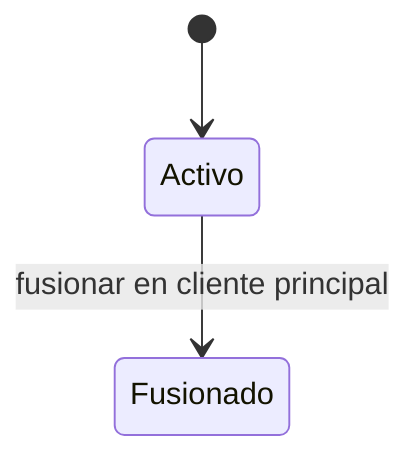

# Modelo táctico de Clientes

**Estado:** versión inicial confirmada el 2026-08-16.

Clientes es autoridad sobre la identidad y datos personales utilizados para reconocer a una persona. No posee ventas, pagos ni saldos; esos datos se consultan desde Operaciones Comerciales.

## Agregado Cliente

`Cliente` es la raíz y mantiene:

- nombre;
- teléfono normalizado;
- DNI opcional;
- dirección opcional;
- estado activo o fusionado;
- referencia al cliente principal cuando fue fusionado.

### Objetos de valor

- `NombreCliente`: texto no vacío.
- `Telefono`: representación normalizada y validada para comparación.
- `DocumentoIdentidad`: DNI opcional validado estructuralmente.
- `Direccion`: descripción opcional e inmutable.
- `ClienteId`: identidad opaca e inmutable.

Los límites exactos de formato y longitud se definirán en la arquitectura de datos sin cambiar el significado del dominio.

### Comportamientos

- `registrar()`;
- `actualizarDatos()`;
- `fusionarEn()`;
- `resolverIdentidadPrincipal()`.

## Invariantes

1. Nombre y teléfono son obligatorios.
2. El teléfono normalizado pertenece a un solo cliente activo.
3. DNI y dirección son opcionales.
4. Un cliente fusionado no se utiliza en ventas nuevas.
5. Una fusión exige cliente principal y duplicado diferentes.
6. El cliente principal debe permanecer activo.
7. La fusión conserva qué registro fue absorbido, cuál quedó como principal, los datos elegidos, el responsable y la fecha.
8. Una fusión no crea ciclos ni cadenas ambiguas: toda identidad fusionada se resuelve a un único cliente principal activo.
9. Los datos personales no se copian a eventos o proyecciones si el consumidor no los necesita.

La unicidad del teléfono requiere un puerto de consulta y una restricción de base de datos como defensa concurrente.

## Fusión de clientes

La fusión es una operación administrativa que coordina dos agregados `Cliente`. El duplicado transiciona a `fusionado` y conserva `clientePrincipalId`.

Las ventas históricas no necesitan reescribirse masivamente. Las consultas resuelven el identificador fusionado hacia el principal, de modo que historial y deuda aparecen consolidados sin perder qué identidad se utilizó originalmente.

Si un caso de uso necesita cambiar expresamente la referencia en una operación activa, deberá hacerlo mediante una corrección trazable coordinada con Operaciones Comerciales.

## Historial y cuenta por cobrar

El historial de cliente es un modelo de lectura que combina:

- la identidad principal y sus identidades fusionadas;
- ventas asociadas;
- pagos y saldos derivados;
- estados de cobro y entrega.

No se incorpora al agregado `Cliente` ni permite modificar ventas. Para empleados excluye costos y márgenes.

## Eventos de Clientes

| Evento | Hecho representado |
| --- | --- |
| `ClienteRegistrado` | Una identidad válida quedó disponible para asociarse a ventas |
| `DatosDeClienteActualizados` | Cambiaron datos personales vigentes con trazabilidad del actor |
| `ClientesFusionados` | Un duplicado pasó a resolverse mediante el cliente principal |

Los eventos usan identificadores y evitan datos personales innecesarios.
