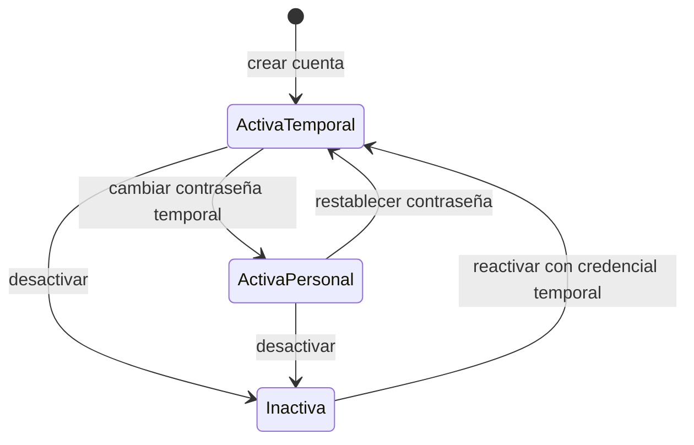

# Modelo táctico de Identidad y Acceso

**Estado:** versión inicial confirmada el 2026-08-16.

Identidad y Acceso autentica colaboradores y determina capacidades. No decide si una venta, devolución o ajuste satisface sus reglas internas; cada contexto continúa protegiendo sus invariantes de negocio.

## Agregado Cuenta de usuario

`Cuenta de usuario` es la raíz y mantiene:

- nombre de usuario normalizado;
- referencia de credencial protegida;
- perfil asignado;
- estado activo o inactivo;
- condición de contraseña temporal o personal;
- versión de seguridad para invalidar accesos anteriores;
- identidad del colaborador utilizada en la autoría histórica.

### Objetos de valor y políticas

- `NombreUsuario`: valor normalizado, no vacío y único.
- `CredencialProtegida`: representación opaca; nunca contiene ni expone la contraseña original.
- `EstadoCredencial`: temporal o personal.
- `Permiso`: capacidad tipada como consultar stock, crear venta o aprobar devolución.
- `PerfilId`, `UsuarioId` y `SesionId`: identidades tipadas.
- `PoliticaDeContrasena`: valida al menos diez caracteres y que la contraseña no coincida con el nombre de usuario.

El hash y la comparación de contraseñas se realizan mediante un puerto criptográfico. El dominio no depende de bcrypt, Argon2 ni otra librería concreta.

### Invariantes

1. Cada colaborador utiliza una cuenta individual.
2. El nombre normalizado es único, incluso entre cuentas inactivas, para preservar autoría inequívoca.
3. Una cuenta nueva o restablecida recibe una credencial temporal.
4. La credencial temporal permite autenticarse únicamente para establecer una contraseña personal antes de acceder a funciones del negocio.
5. El administrador nunca puede consultar la contraseña personal ni su valor recuperable.
6. Cambiar o restablecer contraseña incrementa la versión de seguridad y revoca sesiones anteriores.
7. Desactivar una cuenta impide nuevos accesos y revoca todas sus sesiones sin borrar su autoría histórica.
8. Reactivar una cuenta es una acción administrativa explícita y no restaura sesiones revocadas.
9. Los intentos fallidos no cambian la cuenta a un estado bloqueado.
10. La limitación de frecuencia de autenticación pertenece al adaptador de entrada y no crea un desbloqueo administrativo.

### Ciclo de la cuenta

## Agregado Sesión

Cada inicio de sesión crea o renueva una `Sesión` independiente asociada con una cuenta y un dispositivo lógico.

Mantiene:

- cuenta;
- referencia protegida de la credencial renovable;
- fecha de creación y última renovación;
- versión de seguridad de la cuenta con la que fue emitida;
- estado activo, cerrado o revocado;
- fecha y causa del cierre o revocación.

### Invariantes

1. Solo una cuenta activa con credenciales válidas inicia sesión.
2. La sesión permanece activa en el negocio hasta cierre voluntario, revocación administrativa, cambio de credencial o desactivación de la cuenta.
3. La expiración y rotación de credenciales técnicas de corta duración no terminan la sesión de negocio mientras la credencial renovable siga válida.
4. Cerrar sesión afecta únicamente la sesión utilizada.
5. Desactivar o restablecer una cuenta revoca todas sus sesiones.
6. Una sesión cerrada o revocada no vuelve a activarse.
7. Las credenciales renovables se almacenan protegidas y pueden rotarse sin exponer su valor original.

La duración técnica, tokens y cookies se decidirán en arquitectura de seguridad; el dominio expresa la continuidad y revocación esperadas.

## Agregado Perfil de acceso

`Perfil de acceso` agrupa permisos. En el MVP existen únicamente dos perfiles del sistema:

### Administrador

Posee todas las capacidades operativas y administrativas definidas para el MVP.

### Empleado

Puede consultar catálogo, precios y stock; registrar los clientes necesarios para una venta; crear ventas; gestionar pagos de ventas propias; y consultar la información comercial permitida. No administra productos, clasificaciones, usuarios, costos, gastos, ajustes, bajas, traslados, devoluciones ni datos administrativos protegidos.

Los casos de uso verifican permisos en el backend aunque la interfaz oculte la acción.

La estructura utiliza `PerfilId` y permisos tipados para permitir perfiles personalizados en el futuro. El MVP no ofrece crear, editar ni eliminar perfiles; Administrador y Empleado son perfiles del sistema sembrados y versionados con la aplicación.

### Catálogo inicial de capacidades

Los códigos son contratos estables del backend y no nombres de rutas o botones.
La semilla versionada sincroniza las asignaciones exactas: Administrador recibe
todas las capacidades y Empleado únicamente las indicadas como operativas.

| Módulo | Capacidades versionadas | Empleado |
| --- | --- | --- |
| Catálogo | `catalog:read`, `catalog:manage`, `catalog:approve-price-exception` | `catalog:read` |
| Clientes | `customers:read`, `customers:write-basic`, `customers:merge` | lectura y datos básicos |
| Inventario | `inventory:read`, `inventory:transfer`, `inventory:write-off`, `inventory:adjust`, `inventory:release-reservation`, `inventory:inspect-return` | `inventory:read` |
| Ventas | `sales:create`, `sales:read-own`, `sales:read-any`, `sales:update-own-draft`, `sales:adjust-confirmed`, `sales:finalize-with-balance`, `sales:cancel` | crear, consultar propias y editar borradores propios |
| Pagos | `payments:create-own`, `payments:create-any`, `payments:correct` | `payments:create-own` |
| Compras | `purchases:manage` | ninguna |
| Gastos | `expenses:manage` | ninguna |
| Devoluciones | `returns:approve` | ninguna |
| Dashboards | `dashboards:financial` | ninguna |
| Importación inicial | `imports:initial-products` | ninguna |
| Usuarios | `users:manage` | ninguna |

Reservar unidades forma parte de `sales:create`, porque la reserva nace como una
modalidad de entrega de una venta y no como una operación independiente del
empleado. Liberarla fuera del flujo normal requiere
`inventory:release-reservation` y queda restringido al administrador.

## Eventos de Identidad y Acceso

| Evento | Hecho representado |
| --- | --- |
| `CuentaDeUsuarioCreada` | Un colaborador recibió una identidad y credencial temporal |
| `CuentaDeUsuarioDesactivada` | La cuenta dejó de admitir acceso |
| `CuentaDeUsuarioReactivada` | La cuenta volvió a admitir recuperación mediante credencial temporal |
| `ContrasenaPersonalEstablecida` | La credencial temporal fue reemplazada |
| `ContrasenaRestablecida` | Un administrador inició la recuperación y revocó accesos anteriores |
| `SesionIniciada` | Se estableció una sesión válida |
| `SesionCerrada` | El titular cerró una sesión concreta |
| `SesionesRevocadas` | Todas las sesiones afectadas dejaron de ser válidas por una causa explícita |

Los eventos nunca contienen contraseñas, hashes, tokens ni secretos.
