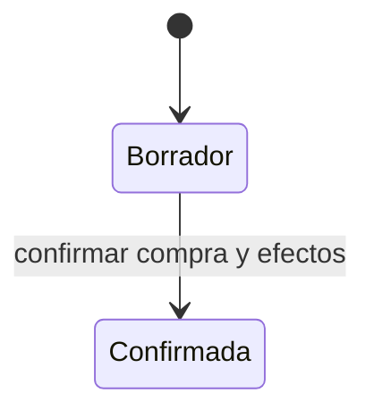

# Modelo táctico de Abastecimiento

**Estado:** versión inicial confirmada el 2026-08-16.

Abastecimiento es autoridad sobre proveedores, compras, costos de adquisición y anticipos. No modifica directamente existencias ni caja; coordina esos efectos mediante Inventario y Finanzas Operativas.

## Agregado Proveedor

`Proveedor` mantiene una identidad estable incluso cuando se registra de manera ocasional desde una compra o anticipo. Esto permite aplicar posteriormente anticipos al proveedor correcto.

Tipos iniciales:

- `registrado`: disponible en el directorio habitual;
- `ocasional`: creado con datos mínimos dentro de una operación y reutilizable por identidad cuando sea necesario.

Nombre o descripción identificable son obligatorios; teléfono, documento y otros datos permanecen opcionales. La clasificación no altera los efectos económicos.

## Agregado Compra

`Compra` es la raíz e incluye líneas, aplicaciones de anticipos y la instantánea necesaria del proveedor.

Cada `Línea de compra` conserva:

- `ProductoId`;
- cantidad entera positiva;
- costo unitario positivo;
- ubicación de ingreso;
- subtotal derivado.

### Invariantes

1. Una compra confirmada contiene al menos una línea.
2. Todas sus líneas pertenecen al mismo proveedor de la compra.
3. El total es la suma de cantidades por costos unitarios.
4. Cada anticipo aplicado pertenece al mismo proveedor.
5. Una aplicación es positiva y no supera el saldo disponible del anticipo.
6. La suma aplicada no supera el total de la compra.
7. El egreso nuevo de caja es `total de compra - anticipos aplicados`.
8. Una aplicación de anticipo no genera otro egreso de caja.
9. En el MVP, cualquier saldo restante de la compra se paga al confirmar; no se crea una cuenta por pagar.
10. Una compra confirmada no sobrescribe líneas ni costos históricos.
11. Confirmación, aplicaciones, ingreso de inventario y nuevo egreso se guardan atómicamente.
12. Un fallo en cualquier efecto deja la compra sin confirmar y no consume anticipos.

### Estados



Una corrección posterior genera operaciones compensatorias; no devuelve la compra a borrador.

## Agregado Anticipo a proveedor

`Anticipo` protege su monto original y la explicación completa de su saldo.

Incluye entidades internas de:

- aplicación a compra;
- reembolso recibido del proveedor;
- reconocimiento de pérdida.

Puede conservar una descripción flexible de productos esperados, incluidos productos existentes, nuevos o todavía no definidos. Esa descripción no limita la compra definitiva.

### Cálculo

```text
saldo de anticipo = monto original
                  - aplicaciones a compras
                  - reembolsos recibidos
                  - pérdidas reconocidas
```

### Invariantes

1. Monto, proveedor, fecha, método y responsable son obligatorios.
2. El monto original es positivo y origina un único egreso de caja.
3. Aplicaciones, reembolsos y pérdidas son positivos y no superan el saldo vigente.
4. Una aplicación solo puede dirigirse a una compra del mismo proveedor.
5. Un anticipo puede aplicarse parcialmente a varias compras.
6. Una compra puede utilizar varios anticipos del mismo proveedor.
7. Un reembolso del proveedor origina un ingreso de caja por el importe realmente recuperado.
8. Reconocer una pérdida exige razón, administrador y fecha; no crea otro movimiento de caja porque el dinero ya salió.
9. Toda mutación utiliza control de versión para impedir consumir dos veces el mismo saldo.

### Situación derivada

| Situación | Regla |
| --- | --- |
| Pendiente | Conserva saldo mayor que cero |
| Resuelto | Su saldo llegó a cero |

La forma de resolución puede ser aplicada, reembolsada, perdida o mixta y se deriva de sus movimientos; no se reduce a un único estado que oculte la composición.

## Cambio de costo

Al confirmar una compra, Abastecimiento compara el nuevo costo con la referencia anterior disponible mediante un puerto. Si difiere, produce una sugerencia de revisión para Catálogo.

La sugerencia no es una orden: no modifica automáticamente precio mínimo, sugerido ni máximo.

El método para atribuir unidades vendidas a costos históricos se decidirá antes del modelo de datos.

## Eventos de Abastecimiento

| Evento | Hecho representado |
| --- | --- |
| `ProveedorRegistrado` | Un proveedor quedó identificado de forma estable |
| `CompraConfirmada` | Compra, costos, ingreso físico y pago restante fueron confirmados |
| `RevisionDePreciosSugerida` | Un costo nuevo difiere de la referencia anterior |
| `AnticipoRegistrado` | Dinero fue adelantado a un proveedor |
| `AnticipoAplicado` | Parte del anticipo se utilizó en una compra |
| `AnticipoReembolsado` | El proveedor devolvió parte o todo el saldo |
| `AnticipoReconocidoComoPerdida` | Un saldo fue declarado no recuperable |
| `AnticipoResuelto` | El saldo llegó a cero, cualquiera fuera su composición |

Los eventos se despachan después de la transacción que persiste sus efectos de inventario y caja.
