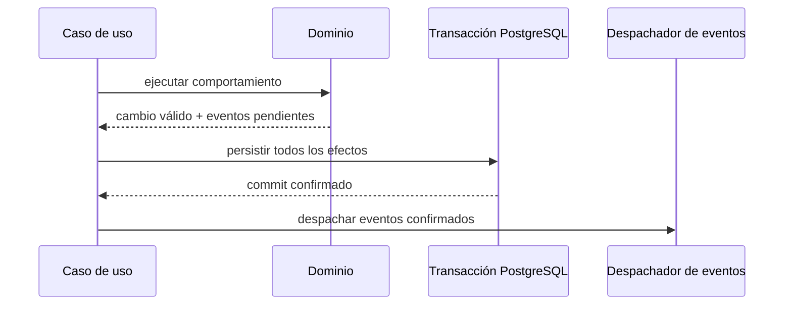

# Eventos de dominio

**Estado:** versión inicial confirmada el 2026-08-16.

Un evento de dominio es un hecho inmutable que ya ocurrió y tiene significado para el negocio. No es una petición, un log técnico ni una fila modificada.

Nova utiliza eventos para expresar hitos, actualizar proyecciones y desacoplar reacciones posteriores. No utiliza event sourcing: el estado actual de los agregados sigue siendo la fuente principal y no se reconstruye reproduciendo eventos.

## Convenciones

- Se nombran en pasado y con significado de negocio.
- Se originan dentro del agregado que conoce el hecho.
- Se despachan únicamente después de confirmar la transacción que persistió el cambio.
- Son inmutables.
- Un consumidor debe poder procesarlos más de una vez sin duplicar efectos.
- No contienen el agregado completo ni modelos de Prisma o DTO HTTP.

Cada evento contiene como mínimo:

- `eventoId`;
- `tipo`;
- `ocurrioEn`;
- `agregadoId` y versión;
- `actorId` cuando existe una acción humana;
- identificador de correlación o causa;
- datos mínimos necesarios para comprender el hecho.

El formato técnico de serialización se decidirá en la arquitectura de software.

## Eventos de Operaciones Comerciales

### VentaConfirmada

**Ocurre cuando:** un borrador válido se confirma junto con sus efectos iniciales.

**Datos relevantes:** venta, cliente opcional, creador, total acordado, líneas confirmadas, pago inicial si existe y fecha.

**Reacciones posibles:** actualizar consultas de ventas, actividad por usuario y analítica. Los movimientos críticos iniciales de inventario y caja ya deben haber sido coordinados dentro de la misma transacción; el evento no se utiliza para completarlos posteriormente.

### PagoRegistrado

**Ocurre cuando:** se confirma un nuevo pago válido perteneciente a una venta.

**Datos relevantes:** venta, pago, monto, método, registrador, fecha y saldo resultante.

**Reacciones posibles:** actualizar cuenta por cobrar, historial del cliente, actividad del usuario y analítica de cobros.

### PagoCorregido

**Ocurre cuando:** un administrador anula o compensa un pago conservando su historia.

**Datos relevantes:** venta, pago original, corrección, diferencia, razón, responsable, fecha y saldo resultante.

**Reacciones posibles:** reconciliar proyecciones de cobro y alertar discrepancias administrativas.

### TotalAcordadoAjustado

**Ocurre cuando:** un administrador cambia justificadamente el total acordado de una venta confirmada.

**Datos relevantes:** venta, total anterior, total nuevo, diferencia, razón, responsable, fecha y saldo resultante.

**Reacciones posibles:** actualizar cuenta por cobrar, margen esperado y auditoría comercial.

### EntregaRegistrada

**Ocurre cuando:** una entrega comercial y su salida física fueron confirmadas.

**Datos relevantes:** venta, entrega, líneas, cantidades, ubicaciones, responsable, fecha y situación de entrega resultante.

**Reacciones posibles:** actualizar seguimiento de la venta y analítica. El evento afirma que la coordinación con Inventario ya terminó; no es una orden para retirar stock nuevamente.

### DevolucionAprobada

**Ocurre cuando:** una devolución, su reembolso y, cuando corresponde, su retorno físico fueron confirmados.

**Datos relevantes:** venta, devolución, líneas y cantidades, monto y método del reembolso, decisión de retorno, razón, aprobador y fecha.

**Reacciones posibles:** actualizar consultas de venta, rentabilidad, actividad administrativa y analítica de devoluciones.

### VentaPagada

**Ocurre cuando:** una operación monetaria lleva por primera vez el saldo pendiente a cero sin condonación.

**Datos relevantes:** venta, cliente opcional, fecha, total comercial neto y pago neto.

**Reacciones posibles:** retirar la venta de cuentas por cobrar y señalar que el acuerdo quedó completamente pagado.

Este es un evento de hito, distinto de `PagoRegistrado`: un pago puede ser parcial y una devolución o ajuste también podría llevar el saldo a cero.

### VentaFinalizada

**Ocurre cuando:** la venta queda sin cobros, reservas ni entregas pendientes y finaliza completamente.

**Datos relevantes:** venta, fecha, tipo de cierre completo y resultados finales de cobro y entrega.

**Reacciones posibles:** actualizar seguimiento, métricas finales y consultas históricas.

### VentaCerradaIncompleta

**Ocurre cuando:** un administrador finaliza la venta aceptando un saldo que no se cobrará.

**Datos relevantes:** venta, monto condonado, razón, responsable, fecha y resultados finales.

**Reacciones posibles:** retirar el saldo de cuentas por cobrar y reconocer la pérdida comercial en analítica.

No se emite además `VentaPagada`, porque el saldo se resolvió por condonación y no por cobro.

### VentaCancelada

**Ocurre cuando:** la cancelación completa, incluidos sus tratamientos monetarios y físicos, fue confirmada.

**Datos relevantes:** venta, razón, responsable, fecha y resumen de pagos, reembolsos, entregas, retornos y reservas liberadas.

**Reacciones posibles:** retirar saldos activos, actualizar analítica y conservar la trazabilidad de la operación anulada.

## Hechos de otros contextos

Cada contexto nombra sus propios hechos. Los eventos candidatos que se detallarán posteriormente incluyen:

| Contexto | Eventos candidatos |
| --- | --- |
| Inventario | Consulta el [modelo táctico de Inventario](context-models/inventory.md) |
| Catálogo | Consulta el [modelo táctico de Catálogo](context-models/catalog.md) |
| Clientes | Consulta el [modelo táctico de Clientes](context-models/customers.md) |
| Abastecimiento | Consulta el [modelo táctico de Abastecimiento](context-models/procurement.md) |
| Finanzas Operativas | Consulta el [modelo táctico de Finanzas Operativas](context-models/operational-finance.md) |
| Identidad y Acceso | Consulta el [modelo táctico de Identidad y Acceso](context-models/identity-access.md) |

Esta tabla no confirma todavía sus cargas útiles ni obliga a implementar todos esos eventos en la primera versión.

## Eventos deliberadamente descartados

### VentaActualizada

Es demasiado genérico. Los consumidores no sabrían qué ocurrió ni por qué importa.

### VentaAtrasada

En el MVP, `atrasada` es un indicador derivado de saldo, vencimiento y fecha actual. No hay una transición persistida a medianoche, por lo que no se inventa un evento. Si más adelante existen recordatorios automáticos, se diseñará un proceso temporal explícito.

### SaldoRecalculado

El saldo es un valor derivado, no una acción del negocio. Los eventos específicos que cambian sus componentes ya explican por qué varió.

### RegistroCreado o EstadoModificado

Son detalles técnicos sin lenguaje de negocio.

## Eventos, transacciones y consistencia

Los eventos no sustituyen la coordinación atómica de las operaciones críticas. Por ejemplo, registrar un pago requiere que `Venta` y Finanzas Operativas se persistan consistentemente antes de despachar `PagoRegistrado`.

Para el MVP, los eventos internos pueden despacharse dentro del proceso después del commit. No se introduce inicialmente un broker, saga ni outbox. Si un consumidor externo o un proceso asíncrono crítico exige entrega garantizada, se evaluará una bandeja de salida transaccional y se registrará la decisión arquitectónica correspondiente.

## Eventos y auditoría

Los eventos de dominio ayudan a explicar lo ocurrido, pero no reemplazan por sí solos el historial persistente de pagos, ajustes, devoluciones y cancelaciones. La auditoría sensible se conserva en el modelo transaccional aunque no exista ningún consumidor de eventos.

Tampoco se publican eventos con datos personales innecesarios. Se prefieren identidades y valores estrictamente requeridos por el consumidor.
