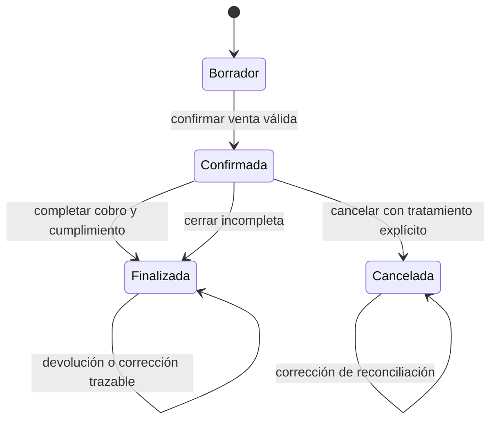

# Estados y transiciones de Venta

**Estado:** versión inicial confirmada el 2026-08-16.

Una venta no se describe correctamente con un único estado. Nova separa el ciclo comercial, la situación de cobro, la situación de entrega y los indicadores de seguimiento para evitar combinaciones ambiguas.

## Las cuatro dimensiones

| Dimensión | Pregunta que responde | Ejemplos |
| --- | --- | --- |
| Ciclo comercial | ¿La operación sigue abierta? | borrador, confirmada, finalizada, cancelada |
| Cobro | ¿Cuánto del acuerdo está cubierto? | sin pagos, parcial, pagada, cerrada con saldo condonado |
| Entrega | ¿Cuánto recibió el cliente? | pendiente, parcial, completa |
| Indicadores | ¿Requiere atención especial? | atrasada, con reserva activa |

Por ejemplo, una venta puede estar `confirmada + pagada + entrega pendiente + con reserva activa`, o `confirmada + pago parcial + entrega completa + atrasada`.

## Ciclo comercial

### Borrador

- Admite agregar, modificar y retirar líneas.
- No genera pagos, reservas, entregas ni movimientos de caja.
- No forma parte de ventas ni saldos confirmados en reportes.

### Confirmada

- Su composición histórica queda fijada.
- Admite pagos, entregas, devoluciones autorizadas y ajustes administrativos permitidos.
- Puede conservar saldo, unidades pendientes o reservas activas.

### Finalizada

- La operación comercial ya no tiene cobros ni entregas pendientes.
- Puede finalizar completa o mediante un cierre incompleto autorizado.
- No admite nuevos pagos, nuevas entregas ni modificaciones del acuerdo.
- Continúa admitiendo devoluciones y correcciones administrativas necesarias para reflejar hechos reales, sin reabrirse silenciosamente.

### Cancelada

- La operación fue dejada sin efecto mediante una cancelación trazable.
- No admite nuevas operaciones comerciales ordinarias.
- Conserva el resultado real de pagos, reembolsos, entregas, retornos y liberaciones.
- Solo admite correcciones administrativas de reconciliación.

## Transiciones del ciclo comercial

No existe transición de `Finalizada` o `Cancelada` hacia `Confirmada`. Si el negocio realiza una nueva operación con el cliente, se registra otra venta.

## Condiciones de transición

### Borrador a confirmada

Exige:

- al menos una línea válida;
- total original consistente con sus líneas;
- cliente identificado si quedará saldo;
- aprobación administrativa si existe un precio inferior al mínimo;
- disponibilidad aceptada por Inventario para cantidades que se entregarán o reservarán;
- pago inicial válido cuando exista.

La confirmación y sus efectos iniciales se aplican de manera atómica: no debe quedar una venta confirmada si falló el pago, la reserva o la entrega requerida.

### Confirmada a finalizada completa

Ocurre cuando:

- el saldo pendiente es cero;
- no quedan cantidades reservadas ni pendientes de entregar;
- no existe otra acción comercial necesaria.

Puede evaluarse después de registrar un pago, una entrega o una devolución. El sistema conserva que el cierre fue `completo`.

### Confirmada a finalizada con cierre incompleto

Exige:

- autorización administrativa;
- saldo positivo;
- razón obligatoria;
- registro explícito del monto condonado;
- ausencia de unidades reservadas o pendientes de entregar.

Si todavía existen unidades no entregadas, primero deben entregarse o liberarse según el acuerdo real. El cierre incompleto resuelve el cobro; no decide silenciosamente qué ocurre con el producto.

### Confirmada a cancelada

Exige:

- autorización administrativa y razón;
- tratamiento explícito de cada pago recibido;
- liberación de toda reserva que siga en el negocio;
- decisión explícita sobre productos entregados y retornos;
- registro de reembolsos y movimientos físicos que realmente ocurran.

La transición completa debe ser atómica. Si falla un movimiento necesario, la venta continúa confirmada.

Una venta finalizada no se cancela: cualquier reversión posterior se representa mediante devolución total o parcial, preservando el cierre histórico.

## Situación de cobro

La situación de cobro se deriva; no se edita manualmente.

| Situación | Regla |
| --- | --- |
| Sin pagos | No existe pago neto vigente y hay saldo pendiente |
| Pago parcial | Existe pago neto mayor que cero y saldo pendiente |
| Pagada | El saldo es cero sin monto condonado |
| Cerrada con saldo condonado | La venta finalizó registrando un monto condonado mayor que cero |

`Cancelada` no es una situación de cobro. Una venta cancelada conserva cuánto se cobró y cuánto se reembolsó, mientras su ciclo comercial informa que fue cancelada.

### Estado de un pago

| Estado | Significado |
| --- | --- |
| Vigente | El pago forma parte del pago neto de la venta |
| Anulado | Una corrección autorizada dejó sin efecto el pago, conservando razón, actor y fecha |

Cuando hubo movimiento real de dinero, la corrección genera la compensación correspondiente en Finanzas Operativas; cambiar el estado del pago no borra la entrada original.

## Situación de entrega

La situación se calcula usando las cantidades históricamente entregadas:

| Situación | Regla |
| --- | --- |
| Pendiente | No se entregó ninguna unidad |
| Parcial | Se entregó al menos una unidad, pero no toda la cantidad comprometida |
| Completa | Se entregó toda la cantidad comprometida |

Una devolución posterior no reescribe el hecho de que las unidades fueron entregadas; registra un hecho nuevo. Por ello una venta finalizada puede seguir mostrando entrega completa y, además, una devolución parcial o total.

## Reservas y cantidades pendientes

La separación se representa mediante cantidades, no como sustituto del estado de entrega:

- `cantidad entregada`;
- `cantidad reservada activa`;
- `cantidad pendiente sin reservar`;
- `cantidad devuelta`.

El indicador `con reserva activa` se muestra cuando al menos una línea conserva cantidad reservada en Inventario. Una reserva liberada deja de estar activa, pero su movimiento histórico permanece.

## Indicador de atraso

Una venta está `atrasada` cuando simultáneamente:

- su ciclo está confirmado;
- conserva saldo pendiente;
- tiene fecha de vencimiento;
- la fecha actual es posterior al vencimiento.

El indicador se calcula al consultar. No requiere un proceso que cambie registros a medianoche y no cancela, bloquea ni aplica recargos.

## Operaciones admitidas por ciclo

| Operación | Borrador | Confirmada | Finalizada | Cancelada |
| --- | :---: | :---: | :---: | :---: |
| Editar líneas | Sí | No | No | No |
| Confirmar | Sí | No | No | No |
| Registrar pago | No | Sí | No | No |
| Registrar entrega | No | Sí | No | No |
| Ajustar total | No | Sí | No | No |
| Cerrar incompleta | No | Sí | No | No |
| Cancelar | No | Sí | No | No |
| Aprobar devolución | No | Sí | Sí | No |
| Corregir/reconciliar | No | Sí | Sí | Sí |

La autorización por rol se evalúa además de esta tabla; que una operación sea válida para el estado no significa que cualquier usuario pueda realizarla.

## Concurrencia

Dos comandos no pueden consumir simultáneamente el mismo saldo o la misma cantidad pendiente. Toda mutación parte de una versión vigente de `Venta`; si otra operación la modificó antes de guardar, el comando debe reintentarse con el estado actualizado o informar el conflicto.

El mecanismo técnico de versionado y bloqueo se decidirá durante la arquitectura de datos.
